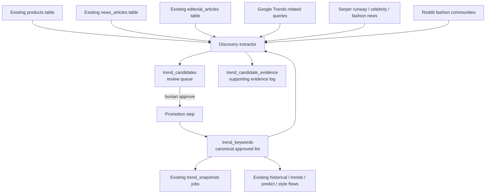

# Trend Discovery And Insight Layer

This is an additive layer on top of the existing Fashlock trend system.

It does **not** replace:

- `trend_keywords` as the canonical approved vocabulary
- `historical_trend_data` as the historical charts / comparisons / prediction source
- `trend_snapshots` as the current composite scoring and ranking source

The purpose is to discover better trend candidates, store evidence for them, and let a human review them before promotion into the existing engine.

## Architecture



## What Stays Unchanged

These existing systems continue to work the same way:

- Discover
- Trends Overview
- Trends Search
- Predict
- Historical Predictions
- Style Brief
- Style Chat
- Existing scraper jobs for `historical_trend_data`
- Existing `trend_snapshots` scoring logic

This layer only improves the upstream discovery and review workflow.

## New Database Layer

### `trend_candidates`

Review queue for candidate trend phrases.

Key fields:

- `phrase`
- `normalized_phrase`
- `source`
- `source_url`
- `context`
- `category`
- `confidence_score`
- `evidence_count`
- `source_diversity`
- `growth_velocity`
- `recency_score`
- `emergence_stage`
- `supporting_evidence`
- `status`

### `trend_candidate_evidence`

Stores each piece of supporting evidence for a candidate trend.

Key fields:

- `candidate_id`
- `phrase`
- `normalized_phrase`
- `source_type`
- `source_name`
- `source_url`
- `source_key`
- `context`
- `evidence_kind`
- `score_contribution`
- `observed_at`
- `metadata`

## Discovery Sources

### Existing local sources

- `products`
- `news_articles`
- `editorial_articles`

### Additive external sources

- Google Trends related queries
- Serper search/news results for:
  - runway reports
  - celebrity style articles
  - fashion trend editorials
- Reddit fashion communities

If an external source is unavailable, the extractor skips it and continues. Existing product/news/editorial discovery still works.

## Extraction Quality Rules

The extractor now prefers structured fashion phrases and rejects noisy fragments.

Examples rejected:

- `green double`
- `blue smooth`
- `misty grey trail`
- `solid sky`

Examples kept:

- `oxford shirt`
- `corduroy overshirt`
- `boxy fit`
- `striped kurta`
- `capri pants`
- `east west bag`
- `butter yellow`
- `office siren`
- `fisherman aesthetic`

## Candidate Insights

Each candidate gets these additive insight fields:

- `source_diversity`
- `growth_velocity`
- `recency_score`
- `confidence_score`
- `category`
- `emergence_stage`

Stages:

- `emerging`
- `rising`
- `peaking`
- `mainstream`
- `declining`

## Review Flow

```text
source data
↓
trend discovery
↓
trend_candidates
↓
human approval
↓
trend_keywords
↓
existing trend engine
```

Nothing is auto-promoted into `trend_keywords`.

## Run Discovery

From the `fashlock` directory:

```bash
python3 scraper/discover_trend_candidates.py
```

Optional limits:

```bash
python3 scraper/discover_trend_candidates.py --product-limit 800 --news-limit 250 --editorial-limit 250
```

The script logs:

- raw phrases found
- filtered phrases
- phrases already present in `trend_keywords`
- new candidates inserted
- existing candidates updated
- new evidence rows inserted
- rejected noise probes
- top 20 candidates by confidence

## Review APIs

### List candidates

`GET /api/admin/trend-candidates?status=pending`

Supported statuses:

- `pending`
- `approved`
- `rejected`
- `promoted`
- `all`

### Approve

```json
POST /api/admin/trend-candidates
{
  "action": "approve",
  "ids": [12, 18]
}
```

### Reject

```json
POST /api/admin/trend-candidates
{
  "action": "reject",
  "ids": [19]
}
```

### Promote approved candidates

```json
POST /api/admin/trend-candidates
{
  "action": "promote"
}
```

### View evidence for one candidate

`GET /api/admin/trend-candidates/:id/evidence`

## Auth

Use either:

- `x-admin-key: <TREND_DISCOVERY_ADMIN_KEY>`
- or local non-production authenticated user fallback

## How This Feeds The Existing Engine

Promotion is the bridge.

1. New phrases are discovered and stored in `trend_candidates`
2. Evidence is stored in `trend_candidate_evidence`
3. Humans approve selected candidates
4. Approved candidates are promoted into `trend_keywords`
5. Existing `trend_snapshots`, historical trend jobs, Discover, Trends, Predict, and Style automatically benefit on future runs

That keeps the current system stable while expanding its vocabulary more intelligently.
